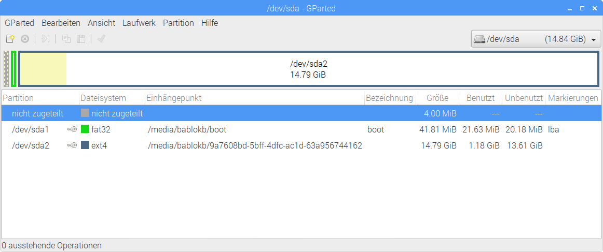
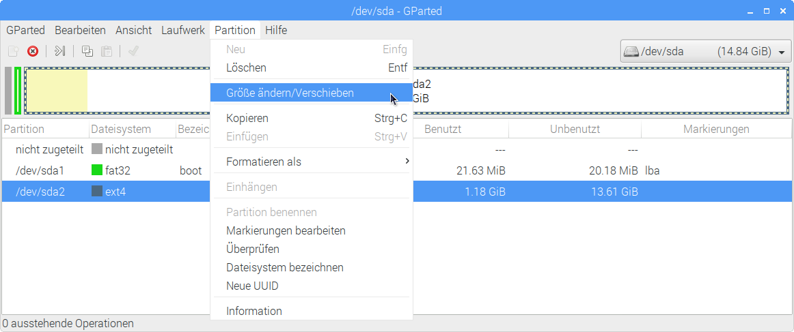
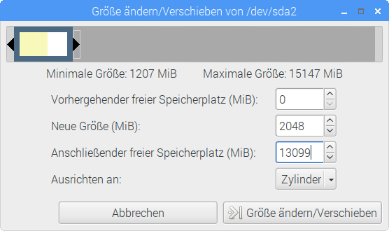
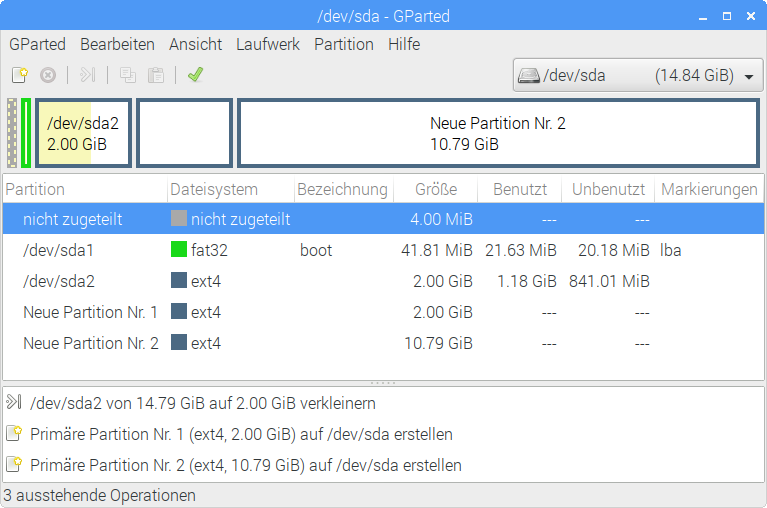

Shrinking the root filesystem
=============================

After complete installation and configuration, the root-filesystem
usually occupies the whole disk (execpt of course the small boot-partition).

To reclaim space for additional system-partitions you first have to shrink
the existing system-partition. This cannot be done while the system is
active, so you have to shutdown the system first.

Th shrink the partition you need a second (Linux) system. The recommended
way is to install the desktop version of Raspbian (Pixel). After installation,
you should additionally install the package `gparted` using the following
commands from a terminal window:

    sudo apt-get update
    sudo apt-get -y install gparted

To start the program, use the desktop-menu or run `sudo gparted` from
a terminal.

Gparted will display it's main window. Using the dropdown on the right
(above the main pane), select the correct device. Be careful to choose
the correct one, if unsure, you can use the menu to query the attributes
of the device.

.

As you can see in the screenshot, the second partition occupies almost all
of the space of the device. The key symbol shows that the partition is
mounted (due to the automounter of Raspbian). Before changing the partition
size, you have to unmount the partition (available from the
partition menu of gparted).

After unmounting the partition, you can change the partition size again
using the partition menu:

.

In the next dialog, you can use the mouse to change the size, or you can
enter the values directly:

.

After changing the size of the second partition, you can also use
gparted to add additional partitions for multiple system-partitions:

.

In this screenshot you can see tow additional partitions. The third
partition will be used as a second system-partition and the fourth
partition as a data partition.

To commit all changes, press the button with the green check mark.
